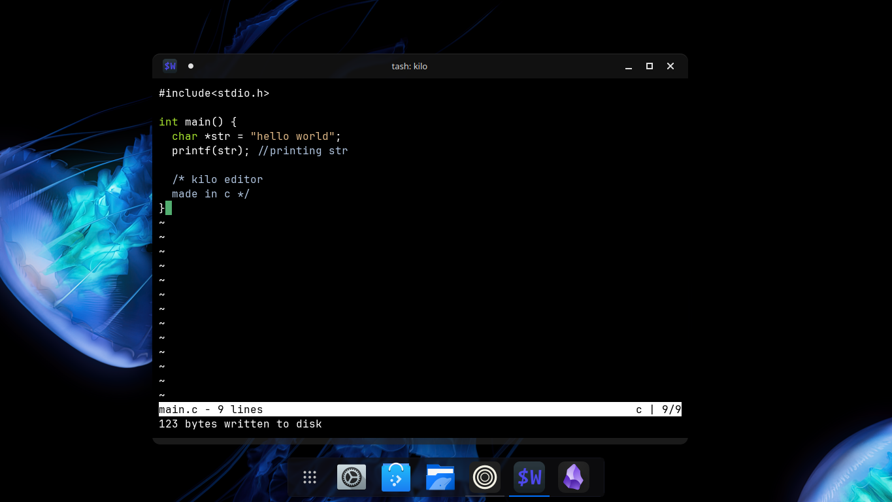

# terminal-text-editor
# Terminal Text Editor

A simple, lightweight terminal-based text editor written in C. Inspired by Kilo, Nano, and Vim — built for speed, simplicity, and learning.

---

## Features

- Open and save text files
- Insert, delete, and navigate text
- Scroll through content
- File saving with `Ctrl+S`
- Searching for words with `Ctrl-F`
- Exit with `Ctrl+Q`
- Search text (basic)
- Single-file implementation (no dependencies)
- Optional syntax highlighting
- passing a file as a flag to open it.

---

##  Screenshot

